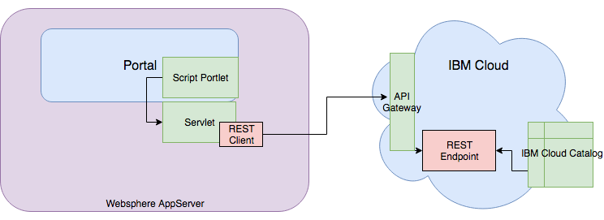

# IBM Portal Extension to IBM Cloud
## Overview

 - [How to Video](#video)
 - [Code details](#code)
 This is the github repo associated with the blog
 "Extending your Portal to the IBM Cloud"
        by Tony Efremenko and Bikram Naha

In this blog, we provisioned a Cloud Weather Company Data service data.  See the IBM console for the Cloud service we used [Weather Company Data](https://console.bluemix.net/catalog/services/weather-company-data)

# Video
In this video, Bikram Naha will show you how to configure the portal
- [Bikram Naha shows how to configure the Portal](./Video/Bikram-Naha-Demo-Cloud-Portal-Script-Portlet.mp4)

# Code
- [Code details](./Code)
